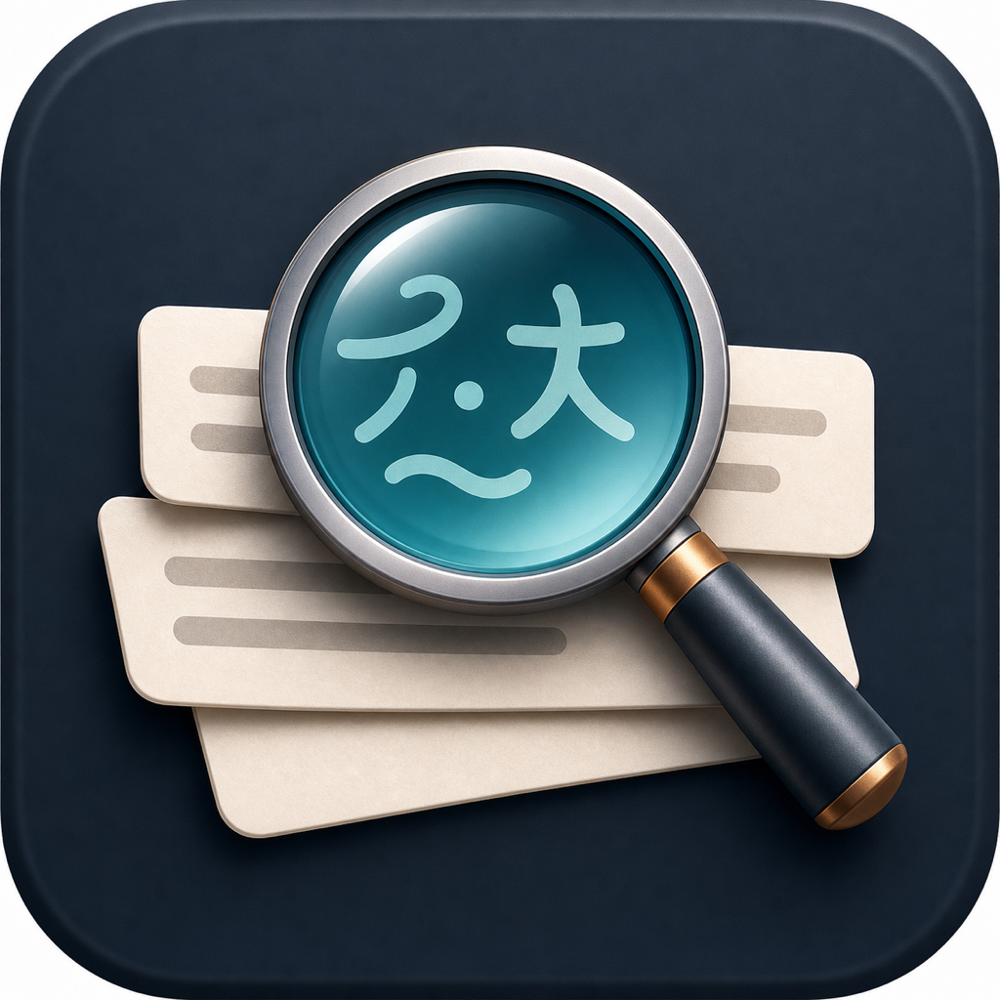

# TextLens（文镜）


    
一个简单好用的原生 macOS 菜单栏小工具：开启“划词自动弹出”后，在其他 App 中选中文本，TextLens 会读取当前选区并弹出翻译和 AI 解释。


## 功能

仅支持两个功能

- 划词弹出翻译和解释
- 支持原生apple 翻译引擎（建议下载，一次即可，翻译速度很快）
- 支持大模型翻译和解释

## 系统要求

- macOS 15 或更新版本
- 使用划词自动弹出需要授予 Accessibility 辅助功能权限

## 构建和运行

```bash
swift test
scripts/package-app.sh
open .build/TextLens.app
```

第一次运行后，在菜单栏点击“文镜”图标，选择“请求辅助功能权限”，然后到系统设置里允许 `TextLens` 使用辅助功能。

`scripts/package-app.sh` 会生成 `.build/TextLens.app`，写入 `Info.plist`，复制应用图标，并进行签名。默认使用本地 ad-hoc 签名，适合开发测试。

## 下载和发布

本项目通过 GitHub Releases 发布 DMG。推送版本标签后，GitHub Actions 会在 macOS runner 上运行逻辑测试、构建 `.app`、打包 `.dmg`、生成 SHA256 校验文件，并把产物上传到对应 Release。

```bash
git tag v0.1.0
git push origin v0.1.0
```

本地也可以直接生成 DMG：

```bash
scripts/package-dmg.sh
open .build/dist/TextLens-0.1.0.dmg
```

当前发布包默认是 ad-hoc 签名，尚未做 Apple notarization。首次运行时如果 macOS 提示开发者无法验证，可以在 Finder 中右键点击 `TextLens.app`，选择“打开”，再确认打开。

## 翻译和大模型配置

打开 TextLens 设置页，可以选择翻译引擎：

- `Apple`：默认选项，使用 macOS 系统翻译能力。
- `大模型`：使用 OpenAI-compatible Chat Completions 做翻译。

大模型用于 AI 解释，也作为 Apple 翻译不可用时的 fallback。需要填写：

- `Base URL`：例如 `https://api.openai.com` 或兼容 OpenAI Chat Completions 的服务地址
- `Model`：例如 `gpt-4.1-mini`
- `API Key`：保存到本机应用配置

## macOS 能力说明

- 选中文本读取使用 macOS Accessibility API，需要辅助功能权限。
- 默认翻译使用 Apple Translation framework。语言不可用、系统翻译失败或用户选择“大模型”时，翻译走 OpenAI-compatible fallback。
- AI 解释通过你配置的大模型完成。

## 隐私说明

- TextLens 不包含遥测、广告 SDK、账号系统或远程日志上传。
- 开启划词自动弹出后，TextLens 会监听全局鼠标/键盘选择意图，并通过 Accessibility 读取当前前台 App 暴露的选中文本。
- 选中文本可能会发送给 Apple Translation，或发送给你配置的 OpenAI-compatible 服务，用于翻译或 AI 解释。
- API Key 存在本机应用配置里，不写入仓库或示例日志。

更完整的说明见 [PRIVACY.md](PRIVACY.md)。

## 依赖

- [PermissionFlow](https://github.com/jaywcjlove/PermissionFlow)：用于引导用户授权 macOS 权限。

## 贡献

- 欢迎贡献，帮助更多的人，如果帮到了你还请不吝 Star🌟
- CI 不包含 UI 测试；请优先补充纯逻辑测试，保持 `swift test` 通过。

## 许可证

TextLens 使用 [MIT License](LICENSE) 开源。
